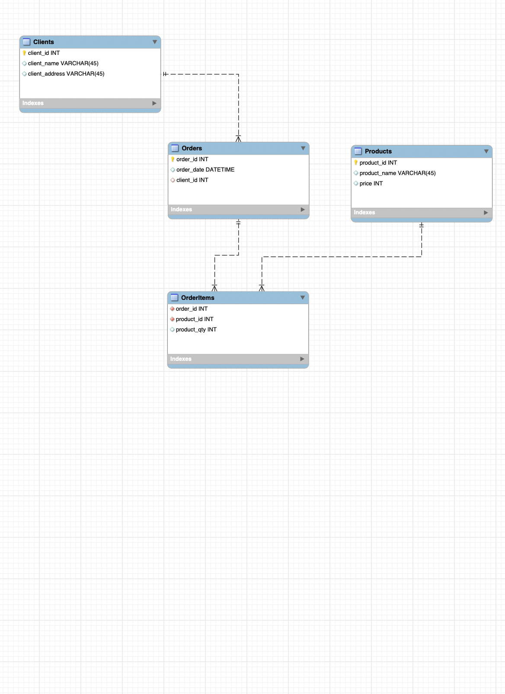

ER-діаграма

> _Приклад вставлення зображення в markdown. Зображення має бути у вашій папці `images`. 
> Файл (наприклад, `er_diagram.png`) можна створити за допомогою експорту з MySQL Workbench._

Короткий опис:
- **Clients** (зберігає дані про клієнтів)
- **Orders** (дані про замовлення)
- **Products** (дані про товари)
- **OrderItems** (перелік позицій замовлень, зв’язка між Orders та Products)