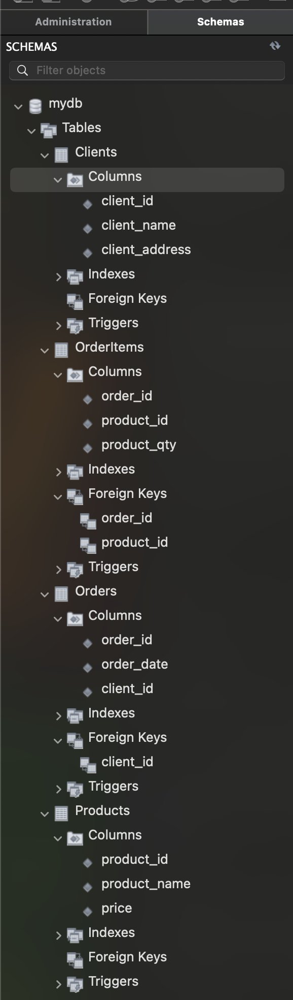

Приклад SQL для створення таблиць


Нижче наведено приклад команд **DDL** (Data Definition Language), які можна використати для створення вказаних таблиць.

```sql
-- Створення таблиці клієнтів
CREATE TABLE IF NOT EXISTS Clients (
    client_id INT PRIMARY KEY,
    client_name VARCHAR(45),
    client_address VARCHAR(45)
);

-- Створення таблиці замовлень
CREATE TABLE IF NOT EXISTS Orders (
    order_id INT PRIMARY KEY,
    order_date DATETIME,
    client_id INT,
    FOREIGN KEY (client_id) REFERENCES Clients(client_id)
);

-- Створення таблиці товарів
CREATE TABLE IF NOT EXISTS Products (
    product_id INT AUTO_INCREMENT PRIMARY KEY,
    product_name VARCHAR(45),
    price VARCHAR(45)
);

-- Створення таблиці позицій замовлень
CREATE TABLE IF NOT EXISTS OrderItems (
    order_id INT,
    product_id INT,
    product_qty INT,
    PRIMARY KEY (order_id, product_id),
    FOREIGN KEY (order_id) REFERENCES Orders(order_id),
    FOREIGN KEY (product_id) REFERENCES Products(product_id)
);